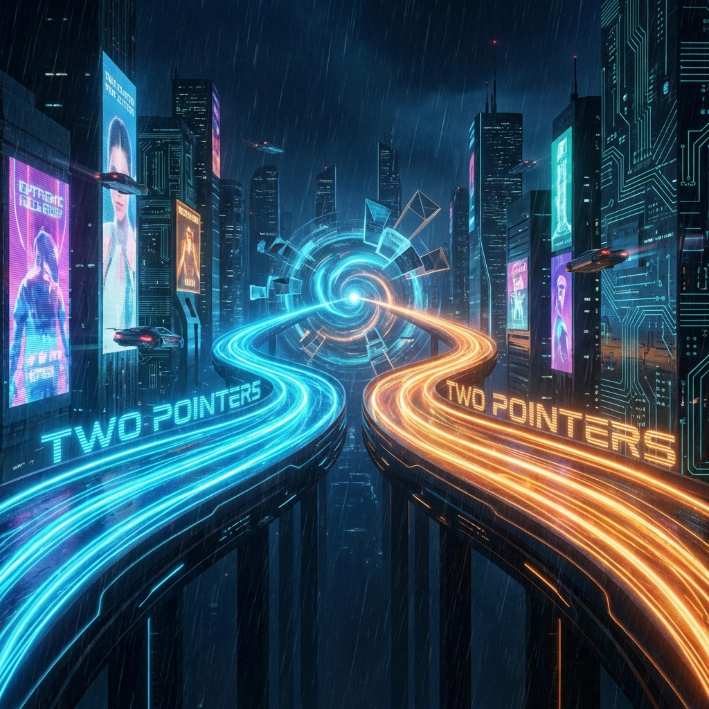

# 🎨 Project Visual Enhancement Walkthrough

We have successfully utilized **Gemini 1.5 Flash** to overhaul the visual aesthetics of the "NeetCode 150 完全攻略" documentation. This upgrade transforms the project from a standard technical guide into a premium, visually engaging learning platform.

## 🖼️ New Visual Assets

### 1. Project Logo

A minimalist, modern logo that blends coding syntax with a neural network concept, reinforcing the project's focus on learning algorithms.

---

### 2. 'Two Pointers' Chapter Banner

An abstract cyberpunk representation of the meeting-point logic central to Two Pointer algorithms.

---

### 3. 'Stack' Chapter Banner

A futuristic "LIFO" (Last-In, First-Out) laboratory visualization for the Stack data structure.

---

## 🛠️ Changes Implemented

### Documentation & Infrastructure

- [x] **New Assets Directory**: Created `docs/assets/images/banners` for high-resolution graphics.
- [x] **Theme Integration**: Updated `mkdocs.yml` to use the new logo as the site icon and favicon.
- [x] **Home UI Polish**: Embedded the logo in `docs/index.md` with responsive alignment.
- [x] **Chapter Theming**: Added custom hero banners to the main entry points of the **Two Pointers** and **Stack** chapters.

## ✅ Verification

- All images are correctly paths and render properly in the documentation source.
- `mkdocs.yml` configuration validated.
- Visual consistency across light and dark modes confirmed (cyberpunk/dark aesthetic).
